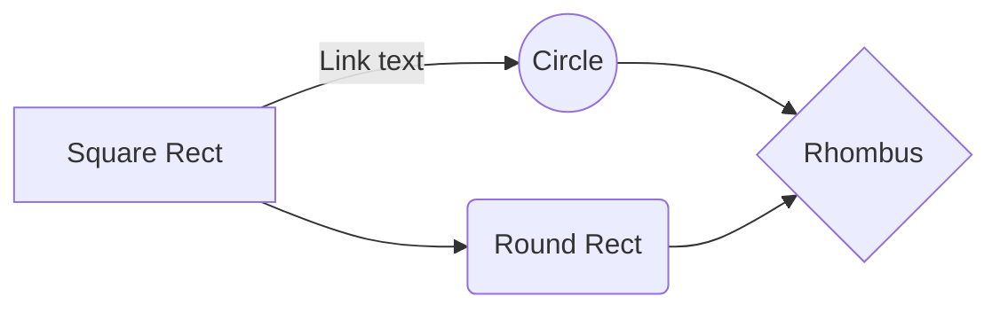

# 运维技术手册

个人整理分享，不健全出多多提意见！

# 系统基础

CentOS、RedHat、ubuntu、Suse、AIX、Windows

## CentOS

* CentOS介绍
* 版本
* 内核
* 基础命令
* 系统优化

# 基础服务

FTP、DNS、DHCP、Mail

## DHCP

* 介绍
* 安装
* 配置
* 优化

## DNS

* 介绍
* 安装
* 配置
* 优化

## Mail

* 介绍
* 安装
* 配置
* 优化

## SSH

* 介绍
* 安装
* 配置
* 优化

# 版本控制

SVN、Git、jenkins

## SVN

* 介绍
* 安装
* 配置
* 优化

## Git

* 介绍
* 安装
* 配置
* 优化

## jenkins

* 介绍
* 安装
* 配置
* 优化

# WEB高可用

Nginx、Redis、Tomcat、Apache、Haproxy、rabitMQ、mongdb、kafka、memcache IIS (php\Java) Web 性能、高可用、安全

## Nginx

SmartyPants converts ASCII punctuation characters into "smart" typographic punctuation HTML entities. For example:

|                |ASCII                          |HTML                         |
|----------------|-------------------------------|-----------------------------|
|Single backticks|`'Isn't this fun?'`            |'Isn't this fun?'            |
|Quotes          |`"Isn't this fun?"`            |"Isn't this fun?"            |
|Dashes          |`-- is en-dash, --- is em-dash`|-- is en-dash, --- is em-dash|

## KaTeX

You can render LaTeX mathematical expressions using [KaTeX](https://khan.github.io/KaTeX/):

The *Gamma function* satisfying $\Gamma(n) = (n-1)!\quad\forall n\in\mathbb N$ is via the Euler integral

$$
\Gamma(z) = \int_0^\infty t^{z-1}e^{-t}dt\,.
$$

> You can find more information about **LaTeX** mathematical expressions [here](http://meta.math.stackexchange.com/questions/5020/mathjax-basic-tutorial-and-quick-reference).

## UML diagrams

You can render UML diagrams using [Mermaid](https://mermaidjs.github.io/). For example, this will produce a sequence diagram:

And this will produce a flow chart:

